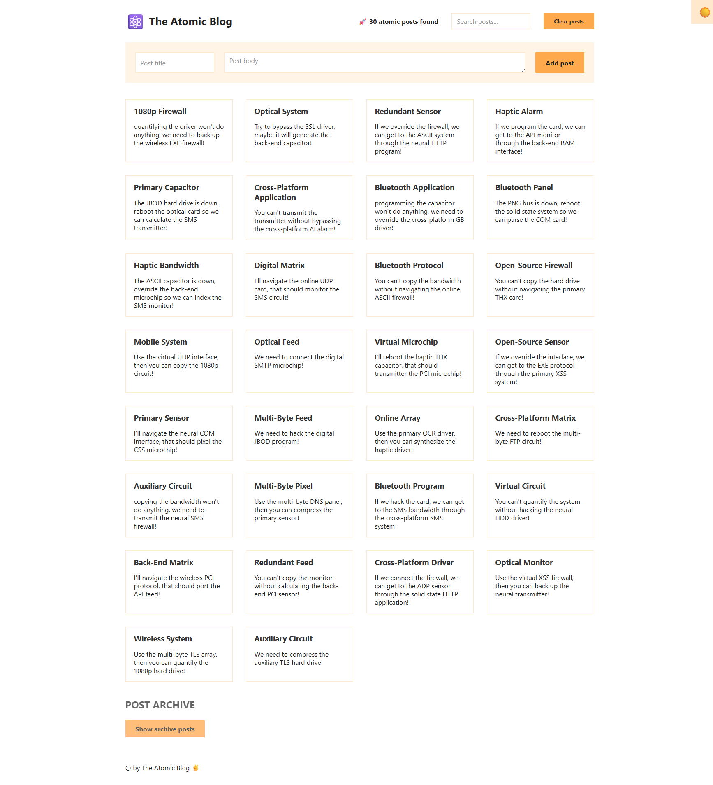
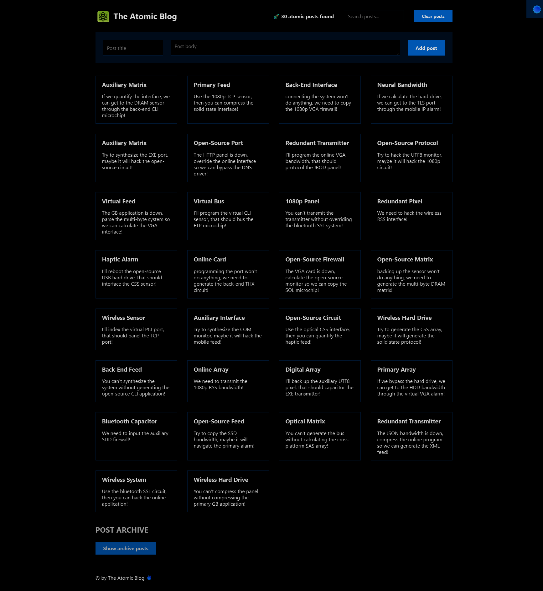

# The Atomic Blog

##Demo

https://atomic-blog-wheat.vercel.app/

## 📸 Preview

`Light Mode`



---

`Dark Mode`



## Project Overview

The Atomic Blog is a React application that demonstrates the use of React Context API for state management. It's a simple blog platform where users can:

- View a list of randomly generated blog posts
- `Add new posts`
- `Search through existing posts`
- `Toggle between light and dark mode`
- `Access an archive of additional posts`

## Key Features

- `Context-based State Management` : Uses React's Context API to manage application state
- `Dark Mode Toggle` : Switch between light and dark themes
- `Post Management` : Add, view, and search posts
- `Archive System` : Access to a large archive of posts
- `Component Structure` : Demonstrates proper component organization

## Technical Implementation

### Context API Implementation

The project uses React's Context API through:

1. `PostContext` : Created using createContext() in the PostProvider.js file
2. `PostProvider` Component : Wraps the application and provides state and functions to all child components
3. `usePosts Hook` : `Custom hook` that provides access to the context values

### Application Structure

The application is structured with the following components:

- `App` : Main component that wraps everything with the PostProvider
- `Header` : Contains the title, search functionality, and post count
- `Main` : Contains the form to add posts and the post list
- `Posts/List` : Displays the list of posts
- `Archive` : Contains a large number of archived posts that can be added to the main list
- `Footer` : Simple footer component

### Performance Considerations

- The application demonstrates React's context API for state management
- The Archive component uses a performance optimization technique by initializing state with a callback function
- The dark mode toggle demonstrates the use of useEffect for DOM manipulation

## Getting Started

1. Clone the repository
2. Install dependencies:

```bash
 npm install
```

3. Start the development server:

```bash
 npm start
```

4. Open http://localhost:3000 to view the app in your browser

## Dependencies

- React 18.2.0
- @faker-js/faker 7.6.0 (for generating random post content)
